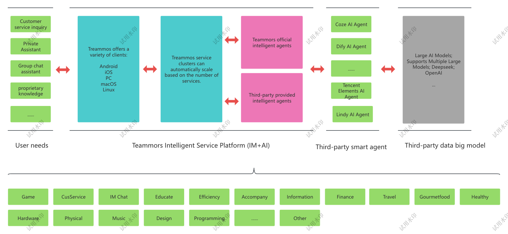
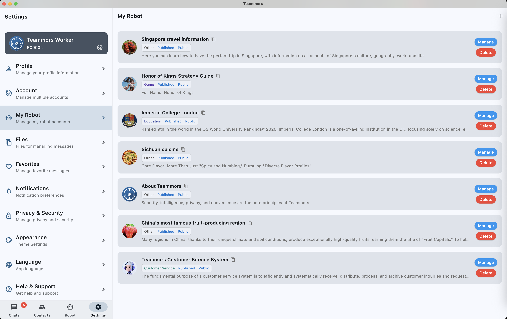
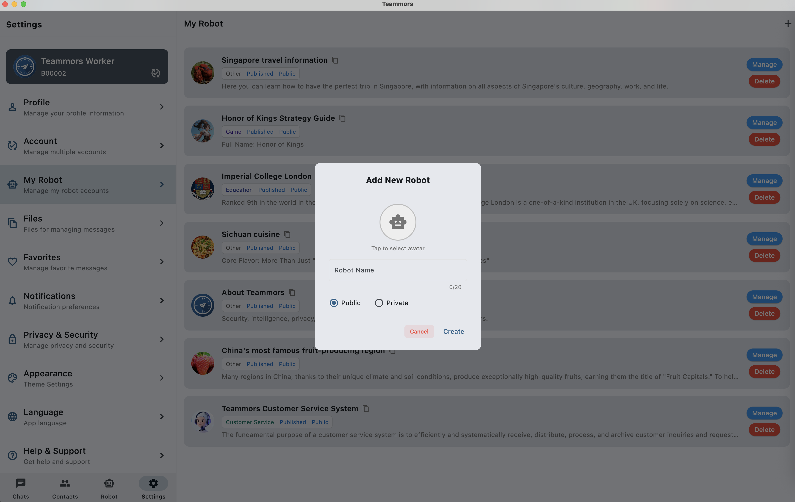
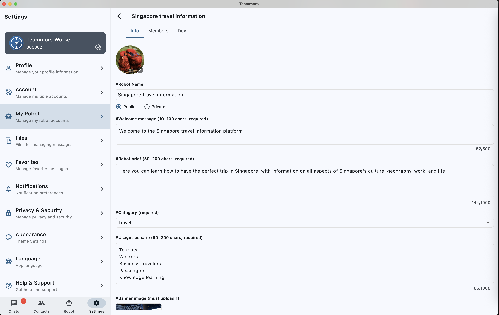
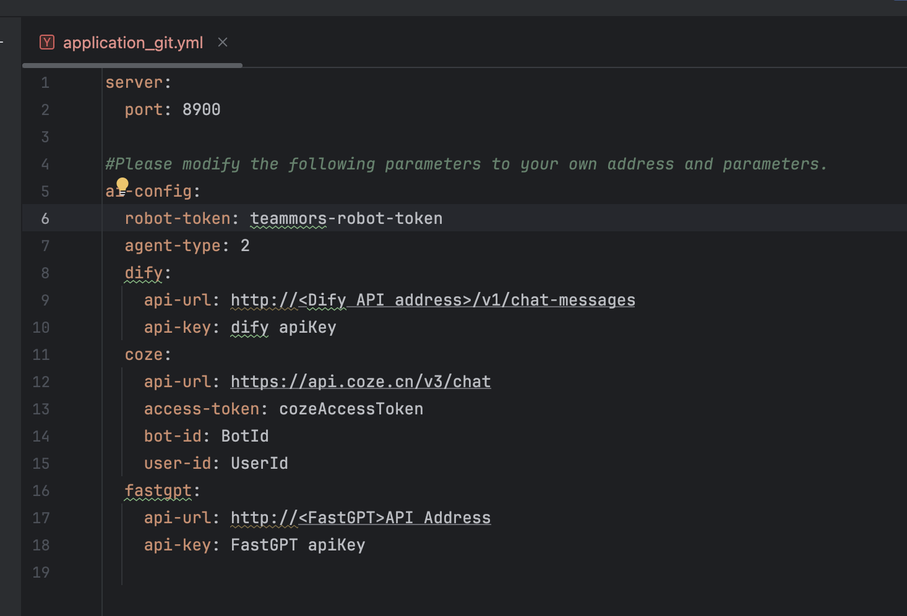
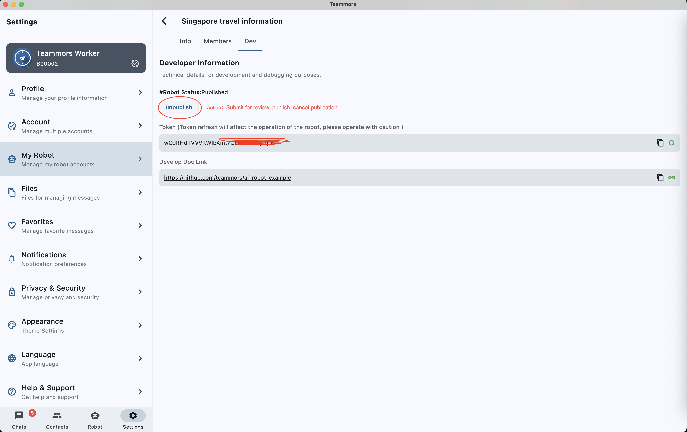

# Teammors Readme

Secure, intelligent, private, and convenient—these are the goals of Teammors.

Teammors is not just a professional IM tool, but also an AI knowledge base user terminal.

Teammors currently supports the following platforms: **macOS, Android, iOS, Windows, and Linux**.

## 📋 Table of Contents

- [Teammors Features](#teammors Features)

- [Business Structure Diagram](#teammors Business Structure Diagram)

- [Building Intelligent Services](#The Process of Building a Teammors Intelligent Service)

- [Client Testing](#Client Runtime Testing)

- [Project Structure](#Project Structure)

---

## Teammors Features

### 🔒 Advanced Security and Privacy Protection

- **End-to-End Encryption (E2EE)**: Enabled by default in "Chat" (including group chat), only visible to the two parties, messages are not stored on the server.

- **Self-Destruct Messages**: Self-destruct countdowns can be set for both private and group chats.

- **Anonymity**: Registration requires only a string.

- **No Data Mining**: No data collection is performed.

### 🤖 Customizable Intelligent AI Bots

- **Third-Party Developers**: Users can open up to multiple knowledge base bots, each with an independent channel, handling message push and message reception. **50,000+ Robot Clusters:** Each robot channel supports over 50,000 subscribers.

**Super Robot Channel:** A stable and efficient robot channel providing a robot SDK for various RAG integrations.

### 💬 Rich Private and Group Chat Features

- Supports multimedia message types including emoticons, images, voice messages, and video messages.

- Supports free voice and video calls.

- Supports large file uploads.

- Supports message editing and reply functions.

- Supports mutual message cleanup.

- Supports setting message cleanup time.

- Supports marking important conversations.

### 🎯 Multimedia Support

- Supports free Voice Calls and Video Calls.

- Supports multimedia message types including emoticons, images, voice messages, and video messages.

- Supports large file uploads, up to 2GB.

### 🌐 Cross-Platform Support

- Supports multi-device login; the same account can be logged in on multiple devices simultaneously.

- Supports multiple languages; users can switch between different languages ​​at any time; currently supports over 20 languages. Supports multiple platform clients: macOS, Android, iOS, Windows, Linux

---

## Teammors Business Structure Diagram

---

## The Process of Building a Teammors Intelligent Service

1. **Download Client**: Download the corresponding client from https://www.teammors.top/

2. **Register Account**: Register an account

3. **Create Bot**: Create a bot

4. **Configure Bot**: Configure basic bot information

5. **Copy Token**: Copy the bot's token for later use

6. **Download Sample Project**: Download the sample project (Spring Boot project) in this example

7. **Creating an Intelligent Agent**: Create an intelligent agent service on a third-party platform or a self-built intelligent agent service platform.

8. **Obtaining Credential Information**: Obtain the access-url, access-token, and other information corresponding to the intelligent agent.

9. **Configuring Parameters**: Fill in the obtained credential information into the Spring Boot configuration file.

10. **Running the Robot**: Start the Spring Boot project.

---

## Client-Side Testing

1. **Completing Information**: Complete the basic information of the robot.

2. **Submitting for Review**: Submit the robot information to the platform for review (1-2 hours).

4. **Listing the Robot**: After approval, list the robot on the development page.

      

6. **User Usage**: Users can use the robot by following it or interacting with it directly.

   

---

## Project Structure
